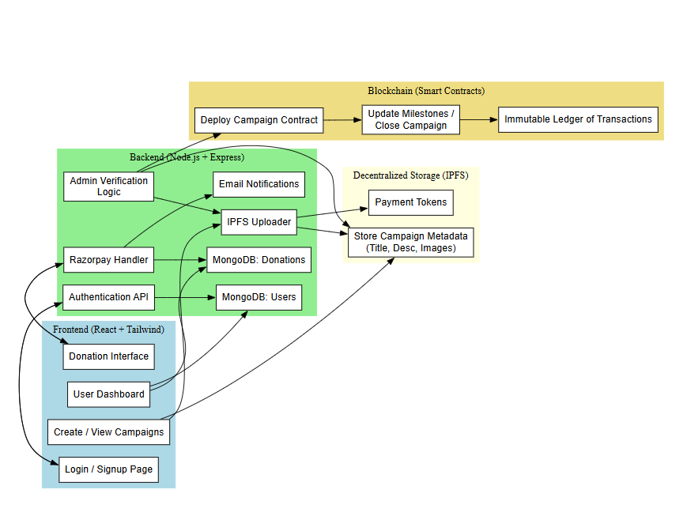

# 🔗 FundChain

<p align="center">
  
</p>

<h2 align="center">Transparent Blockchain-Powered Crowdfunding</h2>
<p align="center">A decentralized platform that brings trust and transparency to fundraising.</p>

---

## 📑 Table of Contents
- [Overview](#overview)
- [Core Features](#core-features)
- [Smart Contract Architecture](#smart-contract-architecture)
- [User Roles & Dashboards](#user-roles--dashboards)
- [Campaign Types](#campaign-types)
- [Development Progress](#development-progress)
- [Tech Stack](#tech-stack)
- [Installation](#installation)
- [Contributing](#contributing)
- [License](#license)

---

## 🔍 Overview

**FundChain** revolutionizes traditional crowdfunding by leveraging blockchain technology to create a transparent, trustworthy platform for fundraising. Our hybrid approach combines the immutability and transparency of blockchain with a frictionless Web2 user experience, making it accessible to non-technical users.

### Key Differentiators:

- **Milestone-Based Funding**: Automatic fund release tied to verified milestone completion
- **Verifiable Transparency**: All transactions permanently recorded on blockchain
- **Multi-Tier Verification**: For enhanced campaign legitimacy
- **Traditional Payment Integration**: No crypto wallet required for donors

---

## 🛠️ Core Features

### 👥 User Authentication
- Email & Password Authentication
- Google OAuth Integration
- Role-based Access Control System

### 🚀 Campaign Management
- Comprehensive Campaign Creation Portal
- Milestone Definition & Tracking
- Document Verification System
- Smart Contract-Based Verification
- Status Tracking: `OPEN | VERIFIED | CLOSED`

### 💰 Donation System
- Traditional Payment Methods via Razorpay
- Blockchain-Verified Transaction Records
- Real-time Donation Tracking
- Email Receipts & Notifications

### 📊 Admin Controls
- Campaign Verification Dashboard
- Fraud Detection & Prevention Tools
- Campaign Lifecycle Management
- Analytics & Reporting Interface

### 📱 User Dashboards
- Donor Activity Tracking
- Organizer Campaign Management
- Milestone Completion Updates
- Fund Withdrawal System

---

## 📐 Smart Contract Architecture

FundChain's blockchain infrastructure consists of two primary smart contracts:

### FundFactory.sol
The master contract that:
- Deploys individual campaign contracts
- Maintains registry of all campaigns
- Handles administrative verification
- Manages admin access control

### FundCampaign.sol
Individual campaign contracts that:
- Track campaign details and status
- Manage milestone definitions
- Process donations
- Control fund distribution based on milestone completion
- Enforce verification requirements

Smart contracts ensure immutable record-keeping and trustless campaign execution while providing transparency to all stakeholders.

---

## 👤 User Roles & Dashboards

### Admin
- Campaign verification authority
- Platform management capabilities
- Analytics & reporting access
- Content moderation tools

### Campaign Organizers
- Campaign creation & management
- Document submission for verification
- Milestone update reporting
- Fund withdrawal requests

### Donors
- Campaign discovery & filtering
- Donation processing
- Tracking funded campaigns
- Receipt management

---

## 📋 Campaign Types

FundChain supports a diverse range of fundraising initiatives:

- **🏥 Medical Emergencies**: Healthcare costs, treatments, surgeries
- **🛕 Religious Causes**: Temple renovations, religious initiatives
- **🫶 NGO Initiatives**: Social impact projects, community development
- **🏛️ Government Projects**: Public works, civic improvements
- **🎓 Education Support**: Scholarships, educational resources, school funding

---

## 📈 Development Progress

### Completed
- Smart contract architecture & development
- Frontend UI/UX design & implementation
- Authentication system
- Campaign creation flow
- Admin verification interface
- Blockchain integration

### In Progress
- Payment gateway integration optimization
- Email notification system
- Campaign analytics dashboard
- Enhanced verification workflows

### Upcoming
- Mobile-responsive optimizations
- PDF receipt generation
- Advanced analytics implementation
- NGO verification via government APIs
- Enhanced security features

---

## ⚙️ Tech Stack

### Frontend
- **Framework**: Next.js 14 (React 18)
- **Language**: TypeScript
- **Styling**: TailwindCSS + shadcn/ui
- **State Management**: React Context + Hooks
- **Form Handling**: React Hook Form + Zod

### Blockchain
- **Smart Contracts**: Solidity
- **Development Environment**: Hardhat
- **Network**: Ethereum (testnet)
- **IPFS Integration**: For document storage

### Backend Services
- **Authentication**: Custom Auth + OAuth
- **Payment Processing**: Razorpay Integration
- **Data Storage**: MongoDB (campaign metadata)
- **File Storage**: IPFS (decentralized)

### Deployment
- **Frontend**: Vercel
- **Smart Contracts**: Ethereum Testnet

---

## 🚀 Installation

```bash
# Clone the repository
git clone https://github.com/yourusername/fundchain.git
cd fundchain

# Install frontend dependencies
cd fundchain-frontend
npm install

# Install smart contract dependencies
cd ../fundchain-contracts
npm install

# Run frontend development server
cd ../fundchain-frontend
npm run dev

# Compile smart contracts
cd ../fundchain-contracts
npx hardhat dev
```
