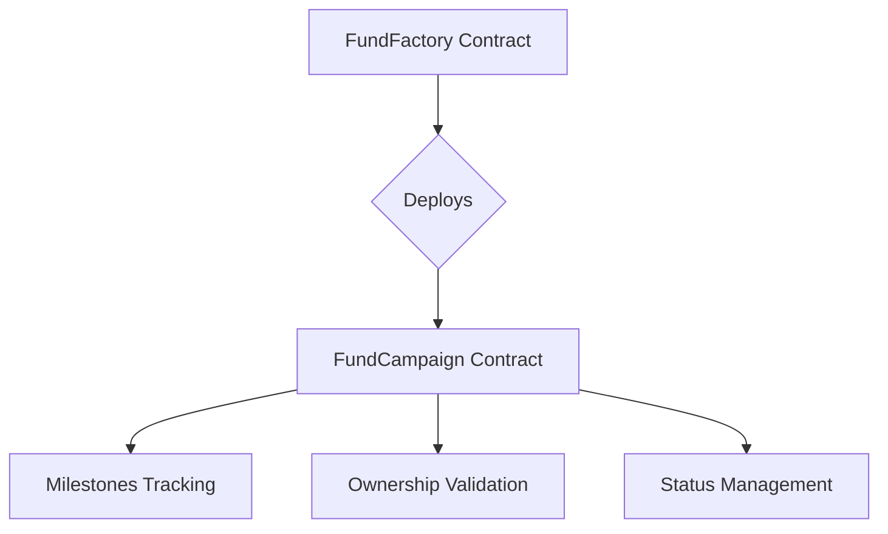

Certainly! Based on the provided guidelines and the information from the FundChain project, here's an updated and comprehensive `README.md` file:

---

```markdown
<p align="center">
  
</p>

<h1 align="center" style="color:orange;">🧡 FundChain</h1>
<p align="center" style="color:white;">A transparent, blockchain-powered crowdfunding platform for everyone.</p>

---

## 🎯 Vision

**FundChain** aims to be the single gateway for all types of fundraising — trusted, transparent, and simple.

⚡ Built with Blockchain Verification + Web2 UX.

---

## 🛠️ Supported Campaign Types

- 🏥 Medical Emergencies
- 🛕 Religious Causes
- 🫶 NGO Initiatives
- 🏛️ Government Projects
- 🎓 Education Support

---

## 🔥 Core Features

### 👥 User Authentication

- Email & Password Login
- Google OAuth Login
- Admin-only Access to Verification Panel

### 🚀 Campaign Management

- Create fundraising campaigns with title, description, target amount, and images.
- Milestone-based progress control (smart contract verified).
- Live donation and milestone updates.

### 💳 Payment Integration

- Razorpay secure payment gateway.
- No crypto wallet required.
- Email-based donor receipts.
- (Coming Soon) PDF receipts with donation breakdown.

### 🔒 Admin Verification

- Manual verification of NGOs, Religious Organizations, or Government campaigns.
- Blockchain smart contract deployment for verified campaigns.
- Status Tracking: `OPEN | VERIFIED | CLOSED`

### 📈 Donor Dashboard

- View your donations.
- Track funded campaigns.
- Personalized recommendations (Coming Soon).

### 🧩 Smart Contracts

- **FundFactory.sol** - Deploy new campaign contracts dynamically.
- **FundCampaign.sol** - Track milestones, organizers, target amount, and statuses.

### 📦 Collaborations

- Official collaborations with NGOs, Temples, or verified Government bodies.

---

## 🧠 Smart Contract Architecture



Smart contracts ensure immutable record-keeping and trustless campaign execution.

---

## 📊 Admin Dashboard Overview 👑

A special panel only accessible to Admin users, for maintaining platform quality, transparency, and trust.

- 📋 View Campaigns: List of all campaigns: Pending, Verified, Closed
- 🔍 Verify Campaigns: Manual approval of NGOs, Religious campaigns, Government campaigns
- 🚨 Flag/Remove Campaigns: Remove suspicious or fraudulent fundraising campaigns
- 📝 Edit Campaign Metadata: Update descriptions, titles, images if necessary
- 🛠️ Manage Collaborators: Add official NGOs, Temples, or Government programs
- 📜 Blockchain Contract Actions: Verify, close, or update campaigns directly through smart contracts
- 📈 Analytics: Admin-only dashboard showing total donations, active users, trending causes

✅ Secure Access: Only verified Admin logins.

✅ Blockchain Powered: Contract-level actions recorded transparently.

✅ Real-time Updates: Campaign status synced immediately after verification.

---

## ⚙️ Tech Stack

- **Frontend**: React.js + TailwindCSS
- **Backend**: Node.js (Express.js)
- **Blockchain**: Solidity, Hardhat
- **Payment Gateway**: Razorpay Integration
- **Database**: MongoDB
- **Hosting**: AWS / Vercel

---

## 🚀 Future Roadmap (V2 Plans)

- 📧 Email alerts for milestone updates.
- 🧾 Downloadable PDF receipts for each donation.
- 🆔 NGO verification via Aadhaar APIs.
- 📊 Live analytics dashboard (Top Donated Campaigns, Donor Patterns).
- 🎯 Personalized donor recommendations.
- 📦 Donation tracking by Cause Type / Geography.

---

## ✨ Color Palette

| Color | Hex Code | Usage |
|:-----|:---------|:------|
| 🖤 Black | `#000000` | Texts, Headings |
| 🤍 White | `#FFFFFF` | Background, Contrast text |
| 🧡 Orange | `#FFA500` | Highlights, Buttons, Banners |

---

